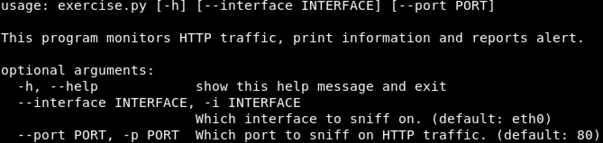

# Key features
1. Use tshark to sniff HTTP traffic on the host
2. Adopt baseline learning at the beginning of the program to set average HTTP request rate
3. Include various statistics : HTTP request rate, Top hits by Section, by Domain, by User-agent, by HTTP Method, by Status code, by Volume per Domain etc.
4. Simple console-style outputs dashboard info with colored scheme
5. Overflow protection: countermeasure of memory overrun by malformed payload
6. By tagging each record with timestamp, enable to age out data that fall out a configurable retention window
7. Highly configurable by static settings to change program behavior 
8. Plug-in design to extend custom statistic modules (NEW)

# Prerequisites
- Wireshark 2.2+
- Python 3.5+
- Use `pip install -r requirements.txt` to install external libraries of followings:
  - Pyshark
  - termcolor

# Usage
- Run unit test cases for the Alerting logic & State transition logic `python exercise_test.py`
- Run the program `python exercise.py` to sniff on 'eth0' or `python exercise.py -i <interface_name>` to specify an interface
- Display help message `python exercise.py --help`
- Use browsers, curl, wget etc. to test out HTTP sites E.g. http://www.bbc.com
- Press `Ctrl+c` to stop the main program
- Optional: edit `exercise_config.py` and customize program behavior 
```python
class Config:
    '''
    Configurations determine the behavior of the exercise program
    '''
    timeout = 2 #Frequency in sec to check for new HTTP transaction, default 2s
    dashboard_bucket_size = 10 #Frequency in sec to refresh dashboard info, default 10s
    average_bucket_size = 60*2 #Bucket size in sec for average HTTP request rate, default 2mins
    average_threshold = 10 #Threshold in percentage to trigger alerts when exceeding <average_baseline>, default 10%
    average_learning_duration = average_bucket_size #Duration of learning for average HTTP request rate, default <average_bucket_size>
    max_str_length = 1024 #Protection of overlong string, default set to 1kb
    max_top_hits = 10 #Display top <N> hits and hide the rest, default top 10 hits
    max_retention_length = 3600*24 #Retention length in sec, used to purge aging data, default 24hrs
```

# Output Screenshot(Sample)
## Help Message


## Learning mode


## Normal dashboard


## Alert message


## Dismissal message


# ToDo
1. Add other useful statistics such as:
   1. Max alert duration
   2. Average alert duration
   
# Design Document
## Use Case(Assumed)
DevOps need a dashboard to monitor general health of HTTP traffic, and alerting on unusual signs indicating issues in the infrastructure, either under attack or hit by performance.

## How Learning works
1. Count HTTP request during entire learning duration, no Alerting is process or performed
2. At the end of each learning duration, if average baseline value is zero, the learning automatically restarts, until baseline becomes non-zero value

**Note**: Learned average baseline does not change as it enters into enforce mode. 

## How Alerting works
1. Start with learning mode, collecting HTTP request per bucket size.
2. At the end of learning, it calculates average HTTP count per bucket size, the rate baseline towards alert calculation
3. Enter into enforce mode, passively count HTTP requests
4. Alert message will be shown, or continue to show when previous average count exceeding baseline+threshold(in percentage)
5. Alert dismissal message will be shown when when previous average count drop below baseline+threshold, it will be removed at next screen refreshing
6. Step#2-4 repeats

**Note**: All previous alert history are preserved and printed at screen for the last 24hrs

## How states transits
- Always starts in learning state, until baseline value becomes non-zero by the end of learning duration
- Enforce mode transation(cycled): normal -> alert active -> alert dismiss

## Improvement and Considerations
There are many things could be considered to better support the assumed use case in real-world production environment, they break down as followings:
### Statistics (examples)
1. Top Hourly, Daily, Weekly, Monthly request rate
2. Top In|Outbound Data volume by source IP
3. Top Data volume by Geo location
4. Top Protocol and Ports by source IP
5. Top SaaS App action performed by source IP
6. Top SaaS App users by request rate
7. Average response time per server
8. etc.
### Architecture and Extensibility
1. SSL termination for backend servers to add visibility without security warnings in the browser 
2. Inline Reverse-proxy not only inspects traffic also protect backend servers in real-time, which enables a long list of Proxy relevant security capabilities.
3. Protocol Coverage
   1. More HTTP based protocol support: E.g. Websockets, SOAP, HTTP2 etc.
   2. More protocol support at layer 3-7: E.g. DNS, DNSSec, QUIC etc.
4. Scale-ability
   1. Use distributed Data store to store statistic information
   2. Use Application server cluster to deploy the solution at scale
### Security features
   1. WAF, CASB, DDoS, Anti-malware, ATP, DLP, SIEM integration, DNS-based security, etc.
   2. Threat intelligence based to build solution based on known good or bad.
   3. Combine supervised and unsupervised Machine learning based approach, to detect anomalies and uncover unseen attack patterns for security. 
   4. Similarly Machine learning approach could also help detect performance anomalies in the infrustructure.
